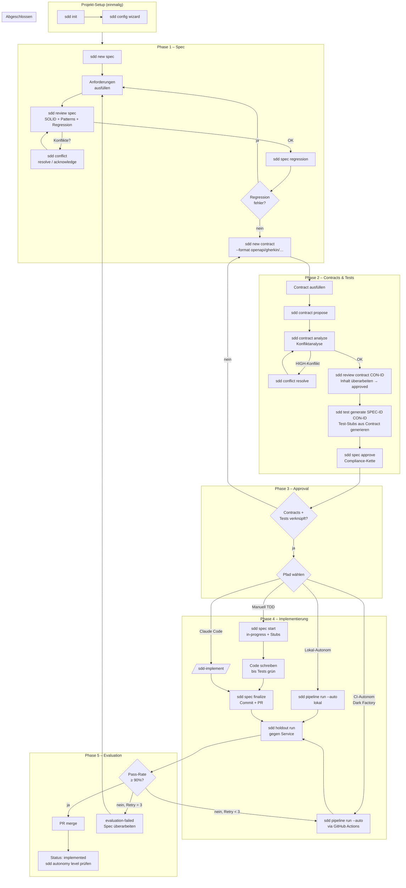
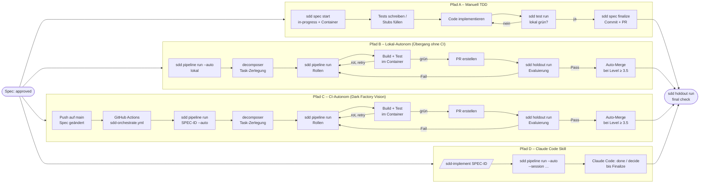
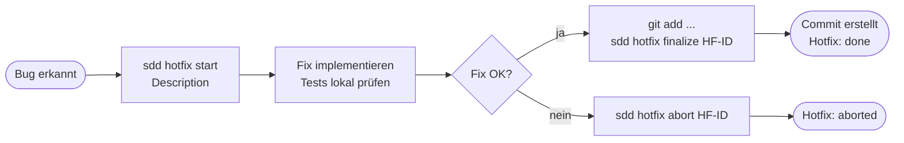
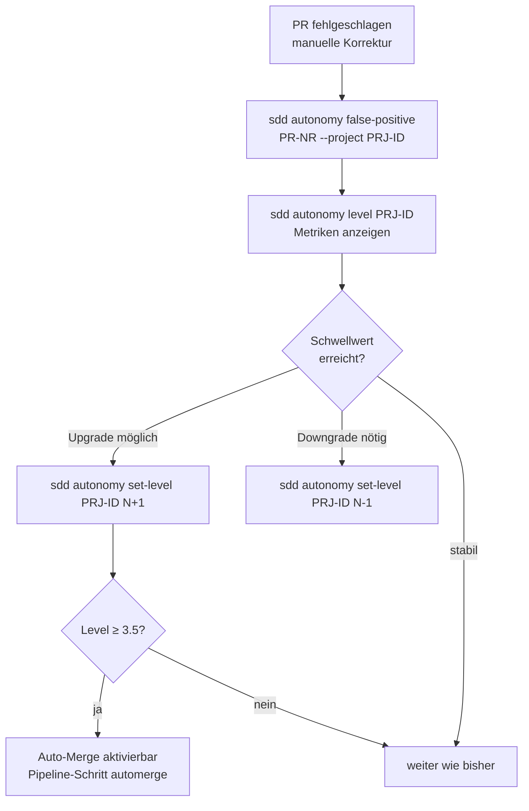

# SDD Reference – Commands, Skills & Flow

> Zielzustand nach SPEC-0044. Alle Befehle folgen dem Schema `sdd <noun> <verb>`.
> Skills sind Claude-Code-Shortcuts; die CLI ist die LLM-agnostische Schnittstelle.

---

## 1. CLI-Befehlsreferenz

### Standalone-Befehle (kein Noun-Fit)

| Befehl | Funktion |
|--------|----------|
| `sdd init [--path] [--title] [--provider] [--force]` | SDD-Struktur im Projekt anlegen, Config-Wizard starten |
| `sdd upgrade [--verbose]` | Schemas und Templates auf aktuelle Paketversion bringen |
| `sdd validate [--strict] [--instruct]` | Frontmatter, Links und Konsistenz aller Artefakte prüfen |
| `sdd trace` | Traceability-Matrix Spec ↔ Contract ↔ Test neu schreiben |
| `sdd status` | Tabellarische Übersicht aller Specs + Hotfixes |
| `sdd pipeline run SPEC-ID --auto` | Autonomer Pfad: Rollen-Pipeline mit Holdout, PR und Auto-Merge (ersetzt `sdd orchestrate`, SPEC-0062) |
| `sdd maintenance [--json] [--auto-pr] [--spec]` | Drift-Sweep: veraltete Specs, fehlende Contracts/Tests |
| `sdd install-hooks` | Git-Pre-Commit-Hook installieren |
| `sdd ui [--port] [--watch] [--no-browser] [--external-url]` | Projekt-Web-UI starten (einzelnes Projekt; `--watch` = Vite Dev-Server + HMR) |

---

### `sdd new` – Artefakte erstellen

Einziger Einstiegspunkt für die Erstellung neuer SDD-Artefakte.

| Unterbefehl | Funktion |
|-------------|----------|
| `sdd new spec "Title" [--owner] [--type feature\|bug-fix]` | Neue Spec-Datei anlegen (draft) |
| `sdd new contract --spec SPEC-ID --format FORMAT [--title]` | Neuen Contract anlegen |
| `sdd new test --spec SPEC-ID --contract CON-ID --level LEVEL [--title]` | Neuen Test-Stub anlegen |
| `sdd new holdout --spec SPEC-ID --title "…" [--contract] [--priority] [--type http\|cli]` | Neues Holdout-Szenario anlegen |
| `sdd new hotfix "Description"` | Neuen Hotfix-Record anlegen |

**Verfügbare Contract-Formate:** `openapi` · `asyncapi` · `graphql` · `grpc` · `json-schema` · `avro` · `protobuf` · `gherkin` · `markdown` · `slo-yaml`

**Verfügbare Test-Levels:** `unit` · `integration` · `contract` · `acceptance` · `performance` · `property`

---

### `sdd review` – Artefakte reviewen

Einziger Einstiegspunkt für alle LLM-gestützten Review-Operationen.

| Unterbefehl | Funktion |
|-------------|----------|
| `sdd review spec SPEC-ID` | Spec reviewen: SOLID-Analyse + Pattern-Vorschläge (≙ `/sdd-review`) |
| `sdd review contract CON-ID` | Einzelnen Contract reviewen: Inhalt überarbeiten, Vollständigkeit prüfen → `approved` (≙ `/sdd-review`) |
| `sdd review contract --spec SPEC-ID` | Alle Contracts eines Specs sequenziell im Loop reviewen |
| `sdd review pending [--auto]` | Contracts im Status `review` ohne Test auflisten; `--auto` reviewed alle |

---

### `sdd spec` – Spec-Pipeline

| Unterbefehl | Funktion |
|-------------|----------|
| `sdd spec approve SPEC-ID [--fr-coverage] [--scenarios-covered]` | Spec genehmigen; prüft Contracts + Tests + Compliance-Kette |
| `sdd spec start SPEC-ID [--auto] [--no-container]` | approved → in-progress; Dev-Container starten |
| `sdd spec finalize SPEC-ID [--dry-run] [--no-commit] [--branch] [--skip-container]` | Commit + PR erstellen |
| `sdd spec estimate SPEC-ID\|--all [--status] [--model] [--json]` | Token-Kosten schätzen |
| `sdd spec regression SPEC-ID [--json]` | Spec gegen bestehende Specs auf Konflikte prüfen |
| `sdd spec solid ARTIFACT-ID [--json] [--principle S\|O\|L\|I\|D]` | SOLID-Analyse (auch für nicht-Claude-LLMs) |

---

### `sdd contract` – Contract-Pipeline

| Unterbefehl | Funktion |
|-------------|----------|
| `sdd contract propose SPEC-ID CON-ID…` | Contracts für Pipeline-Phase `contracts-proposed` vorschlagen |
| `sdd contract analyze SPEC-ID CON-ID…` | Konfliktanalyse zwischen Contracts (Pipeline-Phase `contracts-review`) |

---

### `sdd test` – Test-Pipeline

| Unterbefehl | Funktion |
|-------------|----------|
| `sdd test generate SPEC-ID CON-ID…` | Test-Stubs aus Contract + Spec-Kontext generieren |
| `sdd test run [SPEC-ID] [--all] [--json]` | Tests via pytest ausführen |
| `sdd test results SPEC-ID [--json]` | Letzten Test-Run anzeigen |

---

### `sdd holdout` – Holdout-Pipeline

| Unterbefehl | Funktion |
|-------------|----------|
| `sdd holdout generate SPEC-ID` | Holdout-Szenarien via LLM generieren (≙ `/sdd-holdout`) |
| `sdd holdout run [--hol HOL-ID] [--spec SPEC-ID] [--tier critical\|normal\|edge-case] [--start-container] [--smoke]` | Holdout-Szenarien gegen laufenden Service ausführen |

**Prioritäten:** `critical` (Fail-Fast) → `normal` → `edge-case`

---

### `sdd conflict` – Konflikte verwalten

| Unterbefehl | Funktion |
|-------------|----------|
| `sdd conflict list SPEC-ID [--status open\|resolved\|acknowledged] [--json]` | Konflikte auflisten |
| `sdd conflict resolve SPEC-ID CF-ID --action "…"` | Konflikt als aufgelöst markieren |
| `sdd conflict acknowledge SPEC-ID CF-ID --reason "…"` | Konflikt mit Begründung bestätigen |

---

### `sdd hotfix` – Bugfix-Pipeline

| Unterbefehl | Funktion |
|-------------|----------|
| `sdd hotfix finalize HF-ID` | Staged Changes committen, Hotfix abschließen |
| `sdd hotfix abort HF-ID` | Hotfix ohne Commit abbrechen |
| `sdd hotfix list [--status open\|done\|aborted]` | Hotfix-Liste anzeigen |

---

### `sdd autonomy` – Autonomy Level & Metriken

| Unterbefehl | Funktion |
|-------------|----------|
| `sdd autonomy level PROJECT-ID` | Autonomy-Level-Metriken, Pass-Rate, Upgrade-/Downgrade-Vorschlag |
| `sdd autonomy set-level PROJECT-ID LEVEL` | Autonomy Level setzen (1 / 2 / 3 / 3.5 / 4) |
| `sdd autonomy false-positive PR-NR --project PROJECT-ID` | PR als manuell korrigiertes False Positive markieren |

---

### `sdd config` – Konfiguration

| Unterbefehl | Funktion |
|-------------|----------|
| `sdd config wizard [--section] [--non-interactive]` | Interaktiver Konfigurations-Wizard |
| `sdd config set KEY=VALUE` | Einzelnen Wert setzen (Dot-Notation) |
| `sdd config get KEY` | Einzelnen Wert lesen |
| `sdd config show [--section]` | Gesamte Konfiguration anzeigen |
| `sdd config validate` | Konfiguration auf Vollständigkeit prüfen |
| `sdd config test-llm [--id]` | LLM-Provider-Erreichbarkeit testen |

---

### `sdd obsidian` – Vault-Synchronisation

| Unterbefehl | Funktion |
|-------------|----------|
| `sdd obsidian export [--vault PATH] [--dry-run]` | Alle SDD-Artefakte in Obsidian-Vault exportieren |
| `sdd obsidian import [--vault PATH]` | Geänderte Vault-Dateien ins Projekt zurückimportieren |
| `sdd obsidian watch [--vault PATH] [--interval SEC]` | Vault auf Änderungen beobachten und automatisch importieren |

**Vault-Pfad** wird aus `config.yaml` (`obsidian.vault_path`) gelesen; `--vault` überschreibt.

---

### `sdd pwa` – Mobile Web App

| Unterbefehl | Funktion |
|-------------|----------|
| `sdd pwa start [--port PORT] [--no-browser]` | Eigenständige mobile UI für den SDD-Projektserver starten (Default: freier Port ab 8080) |

---

### `sdd hub` – Multi-Projekt-Dashboard

| Unterbefehl | Funktion |
|-------------|----------|
| `sdd hub start [--port] [--no-browser]` | Hub-Server starten (Default: Port 4711) |
| `sdd hub add [PATH] [--force]` | Aktuelles SDD-Projekt auto-detektiert hinzufügen |
| `sdd hub register --name --path --cmd --port [--force]` | Projekt manuell registrieren |
| `sdd hub unregister PROJECT-ID` | Projekt aus Registry entfernen |
| `sdd hub status` | Alle registrierten Projekte mit Status anzeigen |
| `sdd hub install` | systemd-User-Service + Avahi-mDNS installieren |

---

### Advanced / CI (Pipeline)

`sdd pipeline` ist seit SPEC-0062 der einzige Ausführungspfad. `sdd orchestrate`, `sdd task-route`,
`sdd task-exec` und `sdd task-loop` verweisen nur noch auf ihn (Exit 1).

| Befehl | Funktion |
|--------|----------|
| `sdd decompose SPEC-ID [--yes]` | Spec in klassifizierte Tasks zerlegen |
| `sdd pipeline run SPEC-ID [--dry-run] [--task T] [--auto [--steps …]] [--session ROLLE …]` | Rollen-Pipeline: Tasks über die Modelle aus `llm.roles` umsetzen; `--session` belegt Rollen nur für diesen Run mit Claude Code im Dialog |
| `sdd pipeline decide\|done\|status\|report RUN-ID` | Entscheidung bzw. Session-Ergebnis abgeben, Stand und Report |
| `sdd role eval\|compare\|accept ROLLE …` | Rollen-Evals gegen Golden Cases, Ratchet-Vergleich, Übernahme mit Baseline (SPEC-0055) |
| `sdd role case new\|capture\|confirm …` | Golden Cases anlegen, aus Pipeline-Runs übernehmen, bestätigen |
| `sdd bench init\|run\|report\|compare …` | Benchmark: Modellbelegungen nach Qualität und Tokens vergleichen, Pareto-Front (SPEC-0056) |
| `sdd config apply-roles --from ORDNER --assignment NAME` | Belegung aus einem Benchmark als `llm.roles` übernehmen (Diff, `--yes`) |
| `sdd task-status SPEC-ID` | Task-Status einer Spec anzeigen |

---

## 2. Skills (Claude Code)

Skills sind Shortcuts für Claude Code. Sie rufen intern dieselben CLI-Befehle auf –
für andere LLMs steht immer der entsprechende CLI-Pfad bereit.

| Skill | CLI-Äquivalent | Funktion |
|-------|---------------|----------|
| `/sdd` | `sdd status` | Projekt-Übersicht, Navigation, Quick-Actions |
| `/sdd-new` | `sdd new spec\|contract\|test\|holdout\|hotfix` | Geführtes Anlegen eines neuen SDD-Artefakts |
| `/sdd-implement SPEC-ID` | `sdd pipeline run SPEC-ID --auto --session test_author --session implementer --session supervisor` | Implementierung über die Pipeline; Claude Code schreibt Tests und Code und entscheidet S1–S3 |
| `/sdd-review SPEC-ID\|CON-ID` | `sdd review spec` / `sdd review contract` | LLM-Review: SOLID + Patterns + Vollständigkeit |
| `/sdd-holdout SPEC-ID` | `sdd holdout generate` + `sdd holdout run` | Holdout-Szenarien generieren und ausführen |
| `/sdd-validate` | `sdd validate` | Validierung mit interaktiver Fehlerliste |
| `/sdd-status` | `sdd status` + `sdd autonomy level` | Status-Dashboard mit Metriken |
| `/sdd-config` | `sdd config wizard` | Geführte Konfiguration |
| `/sdd-hotfix` | `sdd hotfix start/finalize` | Hotfix-Flow |
| `/sdd-role-tune ROLLE` | `sdd role eval` + `compare` + `accept` | Rolle gegen Golden Cases verbessern (Ratchet, Holdout bleibt verborgen) |

---

## 3. SDD-Flow – Phasen und Pfade

### 3.1 Gesamtübersicht



---

### 3.2 Implementierungspfade im Detail



---

### 3.3 Hotfix-Pfad (kein SDD-Overhead)



---

### 3.4 Autonomy-Level-Pfad



---

### 3.5 Phasen-Übersicht (Status-Maschine)

```
Spec-Status:    draft → review → approved → in-progress → implemented
                                                        ↘ evaluation-failed → (zurück zu draft)

Contract-Status: draft → review → approved → deprecated

Test-Status:     draft → active → deprecated

Hotfix-Status:   open → done
                      ↘ aborted
```

---

### 3.6 Welcher Befehl in welcher Phase?

| Phase | CLI-Befehl | Skill |
|-------|-----------|-------|
| Projekt-Setup | `sdd init` · `sdd config wizard` | `/sdd-config` |
| Spec anlegen | `sdd new spec` | `/sdd-new` |
| Spec reviewen | `sdd review spec` · `sdd spec regression` | `/sdd-review` |
| Contract anlegen | `sdd new contract` | — |
| Contract vorschlagen | `sdd contract propose` · `sdd contract analyze` | — |
| Contract reviewen | `sdd review contract CON-ID` · `sdd review contract --spec SPEC-ID` | `/sdd-review` |
| Tests anlegen | `sdd new test` · `sdd test generate` | — |
| Spec genehmigen | `sdd spec approve` | — |
| Implementieren (manuell) | `sdd spec start` · `sdd spec finalize` | `/sdd-implement` |
| Implementieren (lokal-autonom) | `sdd pipeline run SPEC-ID --auto` | `/sdd-implement` |
| Implementieren (CI-autonom, Dark Factory) | `sdd pipeline run --auto` via GitHub Actions | — |
| Tests ausführen | `sdd test run` · `sdd test results` | — |
| Holdouts definieren | `sdd new holdout` · `sdd holdout generate` | `/sdd-holdout` |
| Holdouts ausführen | `sdd holdout run` | `/sdd-holdout` |
| Konflikte verwalten | `sdd conflict list/resolve/acknowledge` | — |
| Hotfix | `sdd hotfix start/finalize/abort` | `/sdd-hotfix` |
| Drift-Check | `sdd maintenance` · `sdd validate` | `/sdd-validate` |
| Level-Management | `sdd autonomy level/set-level` | `/sdd-status` |
| Übersicht | `sdd status` | `/sdd` |
| Web-UI (Projekt) | `sdd ui` | — |

---

*Generiert im Kontext von SPEC-0044 – SDD Cleanup & CLI Consolidation*
